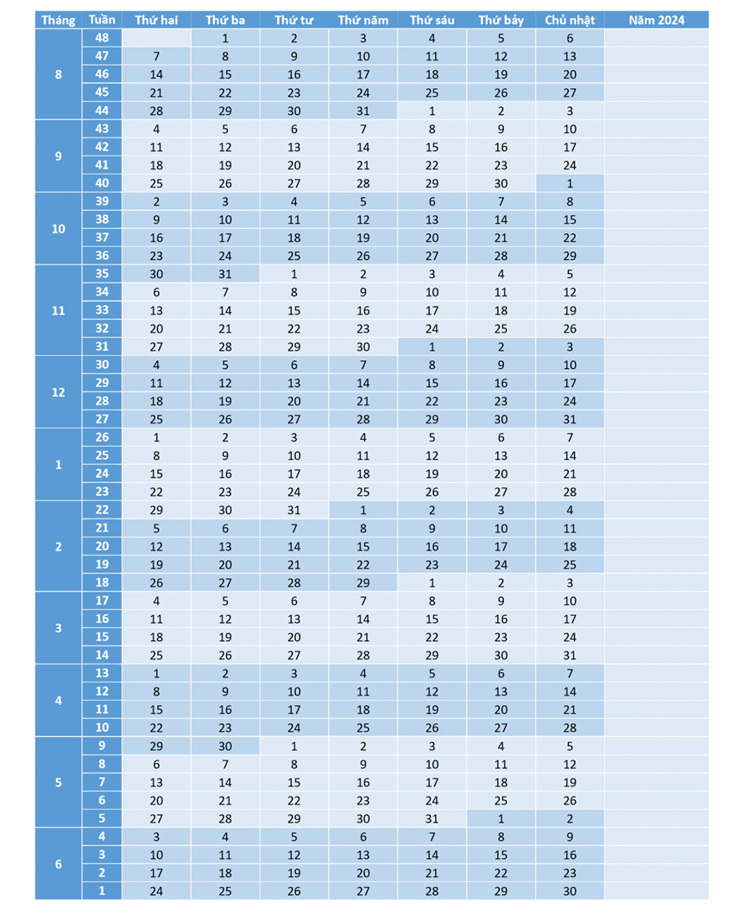

# 3. Tháng bảy, ai trở về
## 1. Sức khỏe
## 2. Cuộc đua sẵn sàng
Có lẽ nhờ tập gym đều đặn, tôi cảm thấy khỏe người với vui vẻ hơn, hứng khởi học hành đã bị vụt tắt từ 1 tháng trước của tôi trở lại. Tôi thấy thời gian của tôi quá lãng phí, cả ngày chỉ nằm rồi bấm điện thoại, trong khi tôi có thể dành ra cả buổi sáng để đi với Thành, 3 tiếng buổi chiều rồi cả buổi tối để học. Nghĩ là làm được, tôi lên kế hoạch tuần sau phải học hết chương Hàm số theo chương trình của Học mãi. Tôi nhận ra mình không lên kế hoạch quá chi tiết, chỉ là những việc cần phải thực hiện trong 1 tuần đó, vừa tạo áp lực, vừa không bị ám ảnh nỗi sợ sai kế hoạch. 

Thêm đó, sau hôm đi tham gia khóa thiền ngày 15/7, tôi bắt đầu thay đổi.
## 3. Tuần đầu tiên, tuần 50 - Hàm số
Thứ hai 17 tháng 7, tôi bắt đầu học, vừa nghe giảng vừa kết hợp làm bài, vừa hiệu quả vừa đỡ chán hơn nghe giảng xong rồi làm. Tối tôi đến trung tâm học Lý, rồi tối lại học bài. Dự định kế hoạch của tôi là chỉ học đến 10h rưỡi thôi và ành thời gian để chơi, vì tôi sợ tôi bị nghiện và không thể nhất thời giảm hẳn sử dụng điện thoại. Nhưng tôi đang có đà học, và rồi là học đến nửa đêm. Tối đó cũng là lúc tôi viết phần đầu của chương 3 Hồi ức.

Hôm sau kế hoạch của tôi cũng như vậy, sáng tập gym, chiều tối học bài, nhưng hôm nay không học thêm, tôi có thời gian cả buổi tối để học. Đến thứ tư hôm sau, tôi đã học đến bài 8 trên tổng số 23 bài, nếu không kể hai bài đầu tiên tôi học trước khi bước vào kế hoạch thì là 6 bài. Chiều thứ tư hôm ấy, tôi thấy làm bài online cũng khá bất tiện khi không được viết vào đề thẳng, tôi định in ra giấy. Sau khi học xong tôi bắt đầu tổng hợp lại tất cả bài tập rồi đáp án để in ra hết. Tôi mất hồn khi thấy số lượng trang chỉ bài tập thôi đã là 1 trăm mười mấy. tôi nghĩ thôi chắc không in đáp án đâu, xem trên máy là được. Vì số lượng trang quá lớn nên không in ở nhà được, một phần cũng vì máy nhà in không đẹp, tôi đi ra ngoài bin bin để in.

Vừa quét nhà xong tôi gửi file qua Zalo nhờ họ in, cỡ 5h sẽ đến lấy. Xong xuôi mọi việc tôi đi ra ngoài đó, cả tiệm vắng, chỉ có bà già với chị nhân viên mới. Bà ngồi bắt chấy cho chị kia, tôi phải tự in. Những lần trước đến đây sẽ có người in, lần này tự in tôi hơi lúng túng nhưng kết quả cũng ổn. Tôi đưa 23k rồi đem cuốn bài tập về rồi ngồi vào làm ngày. Làm vài câu tới giờ cơm mà vẫn chưa ra ăn nên ba mẹ la, tôi thấy hơi bực trong người.

Tôi ăn nhanh rồi vào phòng làm bài tiếp. Cầm quyển bài tập dày cộm trên tay, tôi tưởng tượng thứ tôi đang học không phải Toán mà là môn Hàm số. Tôi đang học một khóa học mà có các môn Hàm số, logarit, tích phân rồi số phức với hình học. Mà tuần đầu tiên này tôi sẽ tập trung hết vào môn Toán 1 – Hàm số trước. Tôi đó tôi tổng hợp thêm các môn Toán còn lại. Nhận thấy cuốn hình học ở chương 2 ít quá, tôi gom lại với chương 5 hình Oxyz. Sau đó tôi tổng hợp lại chương 3 Logarit luôn.

Kế hoạch của tôi cứ vậy ngày này qua ngày khác, nhưng ngày nào cũng khác ngày nào. Tôi thấy từng ngày tôi qua không còn vô nghĩa nhưng hồi tháng trước. Tôi phải lấy lại phong độ của tôi ngày trước, một học sinh giỏi với nhiều thành tích cao. Bởi lẽ tôi chỉ còn năm nay để chiến nữa thôi, tôi phải làm điều gì đó, cái gì đó thật ấn tượng, để khi nhìn lại thanh xuân tôi chẳng có gì tiếc nuối. Tôi nhìn lại thời cấp 2 của tôi mà tự ngưỡng mộ chính mình. Bản thân mình ngày xưa có còn là bây giờ hay không.

Nhưng tôi sẽ phải cố gắng, trở thành tôi của tương lai, để tôi của tương lai nhìn tôi của tương lai mà mỉm cười.

## 4. Tuần thứ 49 - Logarit
Hết chủ nhật, tôi chỉ mới học đến bài 15, tôi thay đổi kế hoạch. Không thể học hết trong một tuần, nhưng tuần qua tôi đã cố gằng và hoàn thành hết phần cơ bản của chương 1. Nếu kết thúc tại đây thì tôi sợ tôi sẽ quên kiến thức. Tôi dàn trải kế hoạch ra học cơ bản một tuần và học nâng cao 2 tuần, trong thời gian học nâng cao sẽ học thêm môn mới, vừa nạp kiến thức mới, vừa không bị quên môn cũ.

Chủ nhật đó, mẹ bị bệnh, hai anh em tôi đi chợ nấu cơm. Chỉ vì quên mua đồ ăn sáng bị mẹ la. Tôi đâm quạu rồi làm xong hết mọi việc để chui vào phòng một mình. Tôi cảm thấy chán khi ở nhà. Tôi muốn ra ngoài, sẵn tiện đi in sách Toán 3 Logarit. 

Lần này lại là tôi tự in, nhưng máy in bị lỗi không in được, tôi kéo ra kiểm tra giấy rồi kéo lại vẫn không in. Rồi tôi nhấn in một lần nữa, lát sau mới chịu ra. Khi in hết rồi, tôi lấy ra và đi lại làm bìa. Sau đó cái máy in ra một bản nữa, vì tôi nhấn hai lần. Vậy là tôi phải trả tiền gấp đôi, trong khi cuốn kia đã bị lỗi khi in giữa chừng hết giấy mà tôi chèn giấy bìa vào. Mà tại bà già ở đó không biết làm nên tôi không giải thích gì được. Nhưng giá 2 cuốn lần này cũng 16k, mỗi cuốn chia ra 8k rẻ hơn rất nhiều với Toán 1.

In xong, tôi chạy ra khu Ngân Thuận để tìm chỗ yên tĩnh định ngồi học. Giữa đường shipper gọi giao hàng, anh nói ba tôi nhận rồi, tôi càng không muốn quay về nhà nữa. Tôi muốn ra ngoài, ở nhà chỉ toàn làm tôi mệt mỏi. Đến công viên không có chỗ học bài, nhưng tôi được yên tĩnh. Tôi lấy điện thoại ra chơi, chỉ ngồi đó thôi tới gần 4 giờ. Hôm đó Thành bận nên không đi đạo tràng được. Tôi về nấu ăn rồi học bài tiếp. Lát sau Thành qua nhà tôi để lấy món đồ máy xay cầm tay mà tôi đặt mới giao khi nãy. Nó có nhắc tôi gần hết tháng gym rồi nên suy nghĩ nên dăng kí tiếp hong. Nó nhớ lộn tưởng sắp đi học rồi, tôi nhắc nó còn tới một tháng lận nên đăng ký tiếp. Tôi thì đang quạu nên nói chiện với nó hong được vui. Đợi khi nó về tôi đi tắm rồi học bài tiếp Toán 1 nâng cao.

Tuần sau đó từ 24/7 đến 30/7 tôi học xong phần cơ bản của Logarit, như lần trước tôi sắp xếp học 2 bài nâng cao còn lại trải đều trong 2 tuần. Tuần 2 này tôi chỉ học được Toán 1 hôm chủ nhật thôi, còn lại tập trung hết vào toán 3.

Hôm thứ 3, tôi đi nghe sư phụ thuyết pháp tại Vĩnh Long, nói dối là đi chuẩn bị sự kiện của chuyên Toán. Riết rồi tôi không muốn nói thật điều gì với ba mẹ. Những lời tôi nói ra với những người thân của mình đề là những lời nói dối, nói dối để họ không hỏi gì nữa, không bàn tán rồi nói chuyện ẩn ý với tôi. Lần trước đi khóa thiền, tôi vừa mang về sự thanh thản, vừa lấy về sự bực bội trước sự nghi ngờ của mẹ. Mẹ không tin tôi đi Vĩnh Long, nói tôi đi thành phố, rồi còn cãi mẹ nhớ này mẹ nhớ nọ mà. Cũng may hôm ấy tôi chụp hình đưa mẹ coi. Nhung chỉ cho mẹ xem vài tấm để mẹ không quẹt qua quẹt lại với những tấm hình không muốn. Chứng minh xong tôi bực bội bỏ vào phòng. Nên rút kinh nghiệm lần trước, lần này tôi không nói đi chùa, mẹ cũng không hỏi gì. Tôi cũng sợ ba sẽ nói này nói nọ, nhưng ba cũng biết gì đó nên không nói tới nói lui. Và bữa hôm ấy được yên ổn.

À lúc đi chùa về, tôi chở Thành đi mua trà sữa quán nhà Thành uống, nó bao tôi, ly trà sữa với cây kem ở chùa. Tôi sợ khi mang ly nước về nhà lại bị nói nữa, tôi lại ra khu Ngân Thuận uống một mình, rồi lại quay về nhanh. Lúc tôi về mẹ vẫn chưa về. Ba hỏi tôi ăn gì chưa, tôi đắng đo nói thật hay giả rồi nói chưa ăn. Sau đó ba đi rước em, mẹ về mua 3 ổ bánh mì, ba đưa em về mua hộp cơm.

Sau khi mọi chuyện ổn, tôi tắm rửa rồi lại vào học. Một tuần cũng thế trôi qua, tôi học hết theo kế hoạch. Vậy là nửa tháng, tôi gần xong học kì 1 lớp 12. Mọi chuyện yên ổn đến khi tôi giận Thành.

Hôm đó, Thành nói tôi 5h10 mới đi đạo tràng, không như mọi lần 5h tôi đã qua. Tôi vẫn thu xếp thời gian đi sớm. Đến nhà nó tôi mới biết mục đích của nó, vì đi chung với mẹ Thành nên nó không muốn đi sớm rồi chạy vòng vòng như hồi trước, nên kêu tôi qua trễ tí để tới trễ, khỏi chờ đợi. Mọi thứ rất bình thường, tôi phá nó, nó phá tôi khều qua khều lại vậy đó, cho đến lúc ra về.

Lúc sinh hoạt nó cứ cầm điện thoại xem tin nhắn của nó với bảo ngọc. Tôi biết nó đang bị giận, tại tội nhắn không trả lời. Lúc sinh hoạt chung thì hình như nó đang nhắn tin giải thích gì đó. Đến lúc về cũng vậy, tôi nói chuyện nó trả lời dăm ba câu. Tôi gợi chuyện câu nó chào ba khi đi “con đi bố bái bai bố” mà tôi thắc mắc tại nó nhanh quá. Nó kêu tôi qua nhà dì ba nó lấy đồ, mà chỉ đường xong lại nhắn tin, lại đi sai đường. Tôi lúc này hơi bực rồi nhưng vẫn ổn. Trên đường đi về nó có la tôi chạy xe ẩu nhưng vẫn không sao, tôi quen với thích nó vậy ròi. Nhưng mà nó bói không nhiều, tôi nói nó không trả lời, sau lưng nó cứ bấm điện thợi. Đến nửa đường 3 tháng 2 tôi quạu thiệt sự, nói chuyện mà nó không nói gì hết, tôi quạu la nó một câu xong bật tốc chở nó về. Chạy hơi nhanh nên nó nói thằng này chạy láo ta, nhưng tôi đâu quan tâm. Chở nó về đưa hết đồ ròi chào một câu là phóng đi.

Về đến nhà là chuyển qua acc nó xem tình hình thế nào, cũng ổn ổn, nhưng tôi thì không. Tối đó tôi giận nó. Làm xong hết phần logarit rồi ngủ. Thứ hai tôi vẫn giận nó. Nó đi Cà Mau với anh em nó. Chiều nó gửi anh sheet nhạc nhờ tôi cắt ảnh, tôi còn giận nên không qua acc trả lời. Tối nó gửi tôi link tiktok mà nhận được quả bơ. Khuya gần 11 rưỡi nó kêu tôi mua evimaxpro cho nó. Thấy lịch sử tìm kiếm có evimaxpro giá bao nhiêu nên tôi vào xem, là thực phẩm chức năng gì đó. Sao đó mà cả ngày thứ 3 nó không nhắn với tôi. Tôi cũng hơi buồn nó rồi tính đợi ngày mai làm lành nhưng không biết sao. Đến thứ tư thì nó gửi link clip cho tôi. Tôi không trả lời. Đến giờ tôi hoc thì nó hỏi tôi đăng nhập học mãi. Lúc này tôi quyết định nhắn với nó, nhưng cảm giác không được thoải mái lắm. Cũng hôm thứ tư 2 tháng 8 đó tôi ăn nhiều nên học không vào, tổng hợp công thức nguyên hàm với đếm lịch còn lại rồi khoe cho nó. Nó đáp vài câu củn cỡn nên tôi chán không thèm luôn. Tối đó nó gửi tôi link thuốc tăng chiều cao. Chán quá nên ko rep. Bên nó thì đang nhắn với người yêu cái chiều cao đó. Cũng may giờ đó hôm sau, là tối thứ 5 đó, tôi rep cho nó vui. May là cuộc nói chuyện thoải mái hơn rồi, đùa giỡn ròi bình thường. Chuyện tiếp theo tôi viết ở gần cuối chương sau, là thứ 6 với sau đó.

Cũng nhờ cái lịch hôm thứ tư tôi soạn đó, tôi quyết định ghi lại hành trình của mình. Ban đầu tôi ghi nhỏ nhỏ chữ hàm rồi tích đồ đó trên đó, nhưng rồi tôi ghi luôn vào đây, dễ nói hơn. Tôi cố gắng ghi lại hành trình của mình để sau này nhìn lại còn thấy được cái gì đó. Bắt đầu chi tiết hơn ở chương sau nè. 3 4 ngày đầu chương sau viết sơ sài vậy đo nhưng sau đó có chuyện để kể, cũng tiếp cho chuyện trên này luôn. Thứ tự tuần mà tôi đánh dấu là đếm ngược số tuần trong bảng đó.

