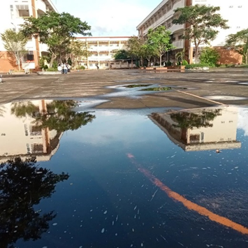
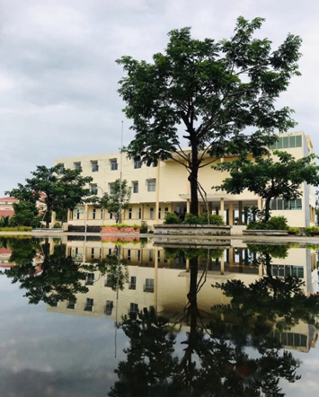

# 11. Gặp mặt
Như đã biết chúng tôi không được gặp nhau từ đầu năm cũng là vì dịch bệnh. Trong khoảng thời gian ấy, vacxin COVID cũng đã xuất hiện, bắt đầu tiến hành tiêm chủng. 

Khoảng thời gian dịch bệnh cũng là khoảng thời gian lười nhác của tôi. Ngủ tới 7h, lười vận động, ăn nhiều,… không nói chuyện với mọi người, sống hướng nội bên trong căn nhà của mình. Thỉnh thoảng vẫn đi ra ngoài đi test Covid, còn lại bị cấm cửa.
Khi vacxin chuẩn bị được tiêm cho trẻ em, chúng tôi phải đăng kí tiêm tại trường. Đó cũng là lúc chúng tôi gặp mặt nhau ngoài đời lần đầu tiên.

Mới lần đầu gặp ngoài đời, nhìn ai cũng lạ. Cô Thảo thì ốm hơn tôi tưởng tượng, Minh cao hơn tôi nghĩ, Bình thấp hơn, Trí nhìn đẹp trai hơn trong ảnh, Vinh mập với to con hơn, Anh Thư xin đẹp lộng lẫy,… Tôi nhìn Khang Dũng cũng không lạ gì lắm, chỉ là lâu rồi không nhìn mặt nhau lại. Giờ nhớ lại tôi không có ấn tượng về Thành lúc đó, không biết bữa đó nó có đi hay không nữa, hoặc là do tôi không dám nói chuyện với ai, kể cả nó, chỉ nói chuyện với mấy đứa quen ở trường cũ nên không ấn tượng tới sự hiện diện của nó.

Chúng tôi theo hướng dẫn đi tiêm ngừa. Sau khi tiêm phải ở lại chờ xem có triệu chứng hay không. Tôi với Khang rồi Dũng đi theo chơi với cô, làm quen với các bạn. Cũng kì lạ, những hôm tôi tới trường đều có mưa, thi tuyển sinh, nộp học bạ, và ngày tiêm ngừa cũng vậy. Sau cơn mưa để lại những vũng nước lớn. Chúng tôi đi vòng quanh chụp ảnh, chụp ngôi nhà mà sau ngày chúng tôi sẽ gắn bó với tuổi thanh xuân.

