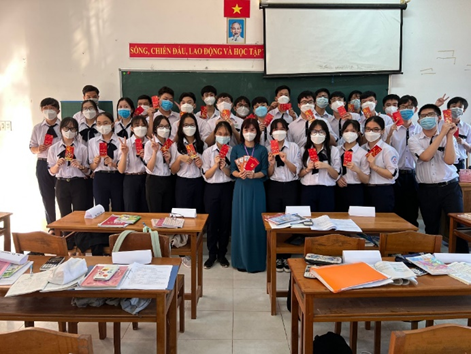

# 13. Về trường
Giờ đây khi nhìn lại, thời gian học online ấy khá vô vị, nhàm chán và buồn tẻ. Có lẽ tôi sẽ không muốn quay lại khoảng thời gian ấy. Nhưng hồi đó tôi không nghĩ như vậy. Mỗi khi có thông báo đi học lại là tôi lại không vui. Tôi quen học ở nhà, ít giao tiếp, nên tôi không thích trở lại học trực tiếp.

Thông báo vào học lại cứ dời đi dời lại, cuối cùng dời qua sau Tết chúng tôi sẽ gặp lại nhau. Nhưng trước đó, hôm trước khi nghỉ Tết, các bạn trong lớp đã tổ chức một buổi tiệc online mừng xuân, với nhiều hoạt động như kể truyện, trò chơi, loto,… Lúc ấy tôi đang dọn nhà nên cũng không quan tâm, chỉ xuất hiện những lúc cần thiết như chụp hình thôi.

Kì nghỉ Tết ấy tôi cũng ít đi đâu chơi, cũng hạn chế dịch bệnh và cũng do tôi sợ nói chuyện với người ngoài. Nhưng mỗi lần đi chơi, tôi dần cởi bỏ lớp áo bên ngoài của mình ra, cởi mở dần với thế giới xung quanh.

Trước những ngày vào học, tôi nhận được đồng phục, do tôi mập lên nên mặc không vừa so với lúc đo. Mẹ của Khang giúp tôi nới rộng quần ra, còn áo thì hơi chật làm tôi hơi khó chịu. Đến giờ tôi vẫn không thích mặc đồng phục trường là do vậy, do tôi mập, cũng chịu giảm cân mấy lần nhưng đều bỏ cuộc.

Vài hôm trước khi nhập học, cô cho chúng tôi chọn chỗ trước. Tôi vốn định ngồi kế Khang như năm lớp 8, nhưng Thành lại kêu tôi ngồi chung, cũng vì lời hứa hồi đầu năm. Công cuộc chọn chỗ có phần gian nan. Phải chọn chỗ sao cho có thể trao đổi với nhiều người giỏi, lại còn chung nhóm với Khang Dũng. 

Lúc tôi nhắn tin với Khang Dũng thì tụi nó chọn ngồi chung với nhau ở cuối lớp, không còn chỗ cho tôi. Tôi với Thành lên bàn đầu ngồi, tôi nói để tập trung hơn thì nó cũng chịu đồng ý. Hồi lâu sau hai chỗ phía sau tôi trống, Khang với Dũng cũng đi lên ngồi với chúng tôi. Tôi cũng chung tổ với Minh Ngọc, Chi Mai, phía sau là Khánh Trường với Phương Thùy. Tú ngồi ở cuối lớp, tổ 2, chung bàn với Trí, theo tôi nhớ là vậy. Sau này Trí chuyển qua tổ 1, Tú ngồi 1 mình bàn cuối tổ 2.

Ngày đầu tiên đi học, cũng là lần thứ 3 được gặp mọi người, sau 2 lần tiêm vacxin. Đó là một ngày nắng đẹp, nắng của mùa xuân, nắng của những điều mới mẻ. Đầu năm mới, chúng tôi được cô Thảo lì xì, mỗi người 10k hay 5k gì đó tôi không nhớ, có 1 bao 20k và ai bóc trúng bao đó sẽ là thủ quỹ của lớp. Và người may mắn đó chính là Anh Thư, một bạn nữ xinh đẹp, giọng trầm và dễ gần. Chúng tôi lần đầu tiên có bức ảnh chụp chung với nhau, dù ai cũng bị chiếc khẩu trang che đi.

Cô Thảo có ý kiến là xếp cái bảng tên nhỏ nhỏ để trước bàn cho giáo viên biết để gọi tên, nhìn trong hình bàn nào cũng có cái bảng trắng trắng chính là cái bảng tên đó. Cái này sử dụng được trong vài ngày, sau đó thì ai cũng bỏ nó đi.

Cảm giác được ngồi trên ghế nhà trường lại sau một thời gian dài rất khó tả, được gặp người mới, nói chuyện với mọi người, gặp những giáo viên đã dạy mình cả học kì qua, là một điều gì đó mà khiến tôi thấy vui vui trong lòng. Lúc đó tôi còn ngại chẳng dám nói chuyện với bạn mới, kể cả Thành. Hai đứa ngồi chung nhưng lại ít nói với nhau, chỉ nói khi cần thiết, đứa này hỏi đứa kia trả lời, rồi im lặng. Hai đứa tôi ngồi nép ra hai đầu bàn. Thỉnh thoảng quay sang nói chuyện, rồi lại quay xuống nói chuyện với Khang Dũng. Giờ ra chơi, tôi với Khang, Dũng đi khám phá trường. Đi vòng qua hết các sân, qua kí túc xá, đi hết các dãy phòng học. Thành ban đầu đi theo chúng tôi, nhưng có lẽ chúng tôi nói chuyện thân với nhau, Thành không xen vào được nên lấy cớ đi về. Tôi cũng cảm thấy áy náy trong lòng, 4 đứa ngồi chung nhưng lại để một đứa như bị cô lập. Chẳng biết có phải đây là nhân quả cho mọi chuyện sau này hay không…

Những ngày sau không có Thành đi theo, chúng tôi vẫn đi dạo khắp trường. Chúng tôi thấy nhiều cặp đôi trong trường quen nhau, dẫn nhau ra ngồi tâm sự trên những băng ghế đá, như là lâu rồi chưa được gặp lại nhau. Và rồi tôi phát hiện Thành đi với một bạn nữ nào đó. Vào lớp chúng tôi chọc thì Thành thú nhận người đó là bạn gái của mình. Chúng tôi thường hay chọc, hỏi thăm tình hình bạn gái của nó, cũng vậy mà có lẽ chúng tôi thân nhau hơn. Tôi cũng điều tra người ấy của Thành la ai để chọc quê, nhưng không tìm được trên facebook, chỉ có sau này nó mới tự thú với chúng tôi.

Khoảng thời gian đầu ấy, tôi vẫn chưa làm quen được với nhiều người. Cứ đi gặp những người quen lớp cũ, hay cứ nỏi chuyện xã giao với Thành. Rồi dần dần mọi người cũng quen biết nhau, mở rộng thêm nhiều mối quan hệ. Thú thật, dù đã trải qua một phần sau tuổi thanh xuân, nhưng chúng tôi vẫn chưa trải qua nhiều kỉ niệm đẹp với nhau. Với tôi, lúc ấy khoảng thời gian đẹp nhất vẫn chính là những năm cuối thời cấp 2, cái tuổi hồn nhiên, vô tư nhưng lại đầy ắp những kỉ niệm khó quên.
