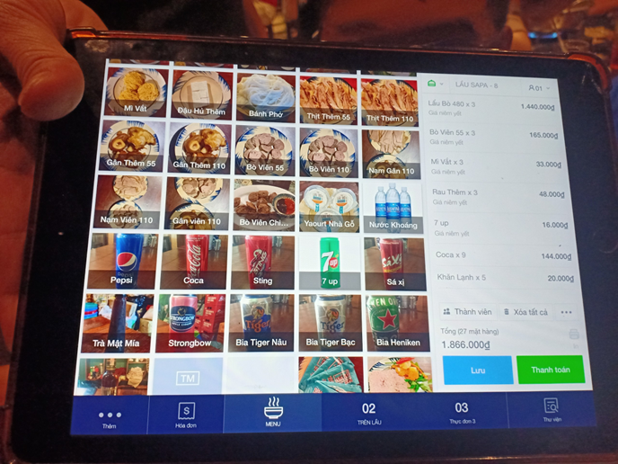
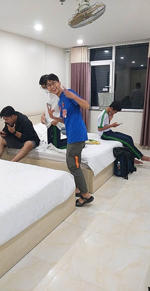
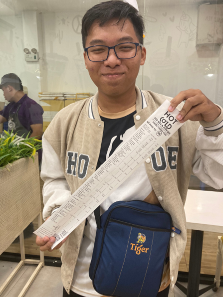

# 26. MOS
“Năm ngoái Hưng đã bỏ lỡ một lần rồi, năm nay không thể để lỡ lần nữa.”

Đó là câu mà tôi đã nói khi đang ở nhà Bình. Khoảng thời gian đó là khoảng đầu tháng 2, cô Khiêm cho link đăng kí tham gia chonj đôi tuyển MOS, giống như năm ngoái. Chỉ tiết năm ngoái tôi sợ, không dám tham gia. Năm nay tôi gan hơn, định thử sức của mình trong năm nay.

## 1. Đăng ký
Dù vậy, tôi vẫn chần chừ, chưa dám đăng kí. Lúc chỉ còn khoảng một tuần tôi mới nhấp vào link đăng ký. Thiệt ra lúc đó thành mở linh đăng ký giúp tôi. Nhưng lúc đó danh sách đã hết hàng nên tôi cũng không đăng ký nữa. Nhưng một thế lực nào đó đã khiến tôi mở lại lưng vào những hôm sau. Khi thấy được tạo ra hàng mới tôi mới dũng cảm ghi tên Nguyễn Gia Hưng vào danh sách. Trong lớp chị có tôi và trọng bảo đăng ký thi chọn đội tuyển.

Trước ngày đi thi tôi không chuẩn bị gì cả chỉ bước vào phòng thi với tâm thế thì cho có. Tôi sử dụng những kiến thức nằm trong đầu mình để làm bài và may mắn thay được ra khỏi phòng thi nhanh nhất. trong phòng thi tôi và trọng bảo ngồi kế nhau nên tôi chỉ bài được cho Bảo. Khi về nhà cũng là lúc có kết quả thi tôi được chọn vào đội tuyển excel, là một trong hai người duy nhất thi ép sale được vào đội tuyển. Còn trọng. bảo thì không. Mình biết là nó buồn nên cũng an ủi nó rất nhiều. Chỉ vì không sử dụng những hàm nâng cao mà không được chọn. Dù kết quả có đúng nhưng không đạt tiêu chí mà cô yêu cầu.

Cảm giác hai đứa đi thi một đứa đổ một đứa rất thật rất khó xử. Tôi được mọi người chúc mừng với số điện cao nhất 1000 điểm. Còn chồng bảo thì tôi biết đang rất buồn. Nhưng chuyện gì rồi cũng sẽ qua. Tôi được vào đội tuyển là niềm vinh dự lớn của tôi. Tôi được anh an, đàn anh chuyên toán khối trên nhắn tin chúc mừng tôi. Tôi cũng hỏi thăm về thông tin đề thi, với một tâm thế hồi hộp và tự hào.

## 2. Luyện tập
Ngày họp đội tuyển đầu tiên cô Thu Hà đã hướng dẫn cho tôi và những người mới cách sử dụng phần mềm để luyện thi. Những lần đầu làm bài, một project tổng của tôi 30 phút, và có khi hơn. Tôi vừa làm vừa xem hướng dẫn. Có rất nhiều cô khó mà tôi không thể làm được. Cũng rất may tôi có gặp anh An và được anh chỉ. Thao tác của tôi ngày càng nhanh hơn. Dần dần tôi luyện tốc độ và độ chính xác. Nhiều số điểm 1000 và thời gian ngắn xuất hiện càng nhiều. Tôi được nhận lời khen và sự kỳ vọng của hai cô.

Không để tôi ngủ quên trên Chiến Thắng, vào ngày học đội tuyển cuối cùng trước khi thi, các cô cho luyện bài Test cuối đợt. Tâm thế làm bà ở nhà và trong phòng thi rất khác nhau. Trong phòng học tốc độ làm bài của tôi giảm độ chính xác của tôi không cao. Có những câu không biết làm phải nhờ anh chị giúp.

Về nhà Tôi biết bản thân còn thiếu sót điều gì. Tôi luyện nhiều hơn, vì chỉ còn vài ngày nữa là tới kỳ thi. Nhưng thực ra tôi luyện cũng không nhiều. Mỗi lần làm 1 bài là lại nhàm chán, không muốn làm nữa. Vì chỉ có bấy nhiêu bài mà phải luyện đi luyện lại sẽ gây nhàm chán.
Biết chuyện tôi đi thi, mẹ hỏi thăm rất nhiều. Mẹ hỏi những câu tôi luyện ra sao và chê là nó quá dễ và nhàm chán, chỉ cần biết tiếng anh và bấm vài cái là rồi. Mẹ bảo tôi học những gì nâng cao. Nhưng tôi nói chỉ luyện tăng tốc độ với độ chính xác của thao tác, khi nào vào vòng trong rồi tính tiếp.

Ngày họp đội tuyển cuối cùng vào thứ 3, các cô thông qua kế hoach. Những ngày sau đó tôi cứ nôn nóng, muốn mọi người ai cũng biết. Tôi chỉ cho Bình với Thành biết. Còn có Như Quỳnh và Minh Ngọc hỏi tôi mới trả lời. Còn Trúc thì lúc đi rồi tôi mới nói. Tôi biết là muốn mọi chuyện thành công thì càng ít người biết chuyện càng tốt. Cứ trầm lặng và bình tĩnh xem xét mọi việc.

## 3. Hành trình
Thứ 6, Thành rủ tôi qua nhà Bình chơi. Trái tim đã vỡ của tôi không muốn, tôi từ chối, lấy lí do ở nhà ôn bài để thi. Thành vẫn qua nhà Bình, vẫn đi thiện nguyện. Trái tim đau đớn không thể làm gì được nữa. Nhưng Những vết chai sạn làm cho nó không thể hiện ra ngoài, khóc thầm trong tim nhưng con tim lại không chịu khóc.

Tôi vẫn mang chiếc mặt nạ tươi vui đến trường, như không có vết thương nào cả. Dù đang buồn đang giận nhưng không để cho ai biết, chỉ luôn mỉm cười trên gương mặt cô đơn. Chính tôi còn cảm thấy khó chịu với chiếc mặt nạ ấy. Nhưng tôi không dám gỡ xuống, không muốn trở lại bầu không khí quạnh quẽ trước đây. Có lẽ thành cũng nhận ra, nói tôi đã khác xưa rồi. 

Nhưng thôi không thể trái tim đánh mất lí trí. Sau khi về nhà tôi phải chuẩn bị đồ gấp. Tắm rửa ăn cơm rồi soạn đồ. Mẹ vẫn như những lần tôi đi xa, dặn dò đủ thứ khiến tôi phát mệt ngay lúc đó. Tôi cũng phát hiện không thấy thẻ học sinh, tìm khắp nơi. Sau đó nhớ lại lúc trước đi coi phim với Trúc có mang theo. Sau đó đưa ví cho Thành. Tôi nhắn thử xem nó có giữ hong. Rất may khi biết nó không bị mất.

Tôi lên xe ba chở đi, qua nhà thành lấy thẻ hs với dây nịt mà lúc đi tôi gấp quá quên mang theo. Lúc đến nơi, tôi đợi Thành lấy đồ ra sao mà cảm thấy lâu quá, trách sao hong biết chuẩn bị trước. Sau khi đưa đồ, tôi lên xe ba và đi tới trường.

Cũng lâu rồi không ngồi lại xe ba chở. Xe chạy nhanh quá, không giống chiếc xxe 50 mà ba mua cho tôi. Ngồi sau ba, ba tôi dặn dò đủ điều, chia tiền thành nhiều ngăn nhỏ, cố gắng thi thật là tốt.

Rồi cũng đến trường. Lúc tới nơi, ba dạn dò thêm vài câu nữa rồi mới đi. Lúc ẩy chỉ có 3 4 người. Từ từ rồi mọi người cũng tới đông đủ. Tôi chỉ quen có Hương Mai, hay chơi chung với mấy đứa nữ lớp tôi. Còn lại mọi người đều là đội tuyển cũ hoặc chung lớp với nhau. Tôi bị cô đơn và ngồi bấm điện thoại cho đến khi lên xe.

Lúc lên xe, mọi người chọn chỗ trước tôi dị ra phía sau xe ngồi. Sau đó bạn Phúc và anh Kiên cũng ra sau với tôi. Bắt đầu chuyến đi, anh Kiên cũng cố bắt chuyện với tôi và Phúc, tôi cũng mở lòng hơn, bớt đi sự ngại ngùng trước đó. Ảnh hỏi tôi chiếc đồng hồ BeU được tặng, giống với Apple Watch. Tôi cũng nói, cười đùa với anh nhiều hơn.

Nói chuyên lâu ròi tôi cũng buồn ngủ. Vừa qua cầu Cần Thơ, bước ra khỏi chiếc ngôi mà lòng tôi cứ xốn xang. Mang trọng trách người con Cần Thơ, bước qua khỏi chiếc cầu này, mang niềm vinh quang về cho miền đất Cầm Thi này. Vừa qua cầu, tôi ngủ đi một giấc dài. Lúc tỉnh dậy xe đang ở trên cao tốc. Nhình cảnh ngoài đường cũng chán, tôi lấy điện thoại ra xem, vừa giết thời gian, vừa không để uổng 75000 mà tôi bỏ ra để mua gói VIP và coi hết một bộ phim Trung Quốc.

Đến trạm dừng chân, tôi và mọi người đi xuống mua nước. Tôi với Phúc mua 2 chai nước suối, bị anh An chê nước suối tên xe đầy mà còn mua. Tôi không biết nói gì hơn chỉ cười trừ cho qua. Thấy mình cũng ngu, sao hong chịu mua nước ngọt uống đã khát. Mà nói thật ở đấy đồ nào cũng đắt, hộp bánh 64k mà Hương Mai cũng muốn mua. Lúc đợi cô và bác tài, chúng tôi đi dạo xung quanh đó, xem đồ, nói chuyện,…

Tiếp tục lên xe, tôi tiếp tục coi phim. Mọi người trên xe cũng bắt đầu bàn chỗ ăn tối. Rồi cả nhóm quyết định ăn lẩu bò ở Nhà Gỗ, nghe nói cũng nổi tiếng ở Sài Gòn. Chúng tôi gọi 3 nồi lẩu nhỏ, thêm rau, mì,… Tôi ngồi kế cô, được cô Hà chăm sóc đồ ăn, ăn ngon cực kì. Cuối cùng tổng kết lại hơn 2 triệu mấy, hết 140k mà trường cho mỗi đứa trước khi đi. Dự tính của trường là cho mỗi đứa 70k một ngày tiền ăn, còn lại tự chi trả. Còn suy nghĩ làm sao để tiêu hết 140k trong hai ngày thi chưa hết ngày đầu tiên tiền đã bay mất.

Trên đường về khách sạn, tôi được ngắm thành phố Sài Gòn về đêm. Đi trên con đường một chiều, xe đi tấp nập, ngắm nhìm những địa điểm mà trước đó chỉ thấy trên tiktok như cà phê Tứ Phủ, trường MariCurie, những trường đại học UEF, Hutech,…

Đến khách sạn Sao biển, chúng tôi lấy đồ vào trong sảnh làm thủ tục check in. Đoàn chúng tôi 6 nam 6 nữ, không biết có phải sự trùng hợp hay không. Nam và nữ ở riên, nữ ở phòng 4 người và phòng 2 người, nam cũng vậy. 3 anh đội tuyển cũ chung một phòng, lựa một trong 3 người mơi chúng tôi là tôi, Khang với Phúc. Anh Kiên rủ Khanh nhưng Khang từ chối, nên là chọn Phúc, còn tôi được ghép chung với Khang.

Nói về Khang là một người đẹp trai, nụ cười đẹp, là nam sinh thân thiện của trường năm nay. Trong đội tuyển thì có Khang là thu hút sự chú ý của tôi, từ những ngày bắt đầu học đội tuyển. Trước khi đi, tôi có linh cảm được ngồi chung với Khang trên xe hay ở chung phòng gì đó. Và đúng thật tôi được ở chung phòng với Khang.

Lúc đó tôi cảm thấy vui vui, nhưng tính tôi ít nói, chẳng biết nói chuyện với nhau thế nào. Lúc lên phòng, tôi có bắt chuyện, bảo đi tắm với chuẩn bị đồ. Nhưng nói nhiu đó rồi thôi, chẳng biết nói gì khác. Rồi 2 đứa lên giường mỗi đứa một cái điện thoại, một góc riêng. Khang đi xuống rửa tay, thì bị ướt, đi ra ngoài làm gì đó rồi trở vào. Tôi đi vệ sinh trước, dù là 2 người nam ở với nhau nhưng tôi vẫn khép cửa vì ngại. Đến lúc Khang đi thì phát hiện cửa không khóa được. Lúc đó tôi cũng mới để ý. Khang cũng khép sơ cửa lại, đi xong rồi thi đi xuống báo với khách sạn. 

Lúc ông chú khách sạn lên nói cửa nó là vậy rồi, tôi với Khang cũng mặt kệ. Tôi tiếp tục lướt tiktok, Khang cũng làm việc riêng. Rồi nó bỏ ra ngoài, để lại tôi một mình. Hồi lúc sau tôi thấy lâu quá với chán quá, nhắn hỏi anh An có tính đi đâu hong. Ảnh trả lời tính đi café, rủ tôi đi chung. Tôi hỏi có Khang ở đó hong thì ảnh nói có.

Tôi mới mang giày, đi ra. Vừa lúc đó gặp Khang, nói định lên rủ tôi đi chơi. Cái nó vô lấy ví tiền, rồi cả hai đi xuống. Cả đám chỉ có mình 2 đứa tôi chưa tắm. Nãy tới giờ chỉ có bấm điện thoại, Khang không đi tắm nên tôi cũng không, hoặc ngược lại. Lúc đó bị anh An và mọi người chê cười, tôi cũng cười cho qua.

Chúng tôi đi bộ ra đường lớn, gặp quán trà sữa xiên que Hot Cold bên kia đường. Chúng tôi qua đường rồi tập vào, đứng một đống 12 người trong quầy order chút xíu. Mọi thức uống đề dắt đỏ, trên 40k, xiên que một phần nhỏ đã 80k. Tôi còn nhớ đã gọi trà nho, vì topping buổi tối cũng gần hết, không suy nghĩa được nhiều. Tôi lỡ chốt nhầm size nhỏ nên đỡ được tiền. Nhưng tổng kết lại biên lai của cả đám dài như một tờ sớ.

Ngồi uống trà sữa nói chuyện, các anh thì giải đề toán logic, toi thì chơi bpngs rổ với đửa nhỏ trong quán, Khang thấy cũng chơi theo. Tới khoảng 9h thì chúng tôi ra về. Lên tới phòng, Khang đem đồ đi xuống, hỏi tôi muốn xuống chơi không, nhưng tôi chọn ở lại, nói xíu nữa rồi xuống. Hỏi Khang tối ngủ ở đâu thì nó nói có thể lên đây.

Tôi tắm xong, sắp xếp đồ đạc rồi lấy máy ra ôn bài. Tôi không có ý định đi xuống. Một phần tôi không thích đông người, một phần muốn yên tĩnh, tập trung ôn bài và tự do hơn. Âm thanh trong phòng yên tĩnh quá cũng thấy hơi buồn, tôi mở tivi lên, chọn đại kênh thể thao, có âm thanh cho đỡ nhàm chán. Máy lạnh bật mức lạnh nhất, set up máy tính, tivi, điện thoại đầy đủ, tôi bắt đầu luyện đề. Mục tiêu phải làm hết tất cả các bài và đặt full 1000 điểm.

Đang luyện bài thứ 2 thì Khang đi lên, lấy gối và nói tối ngủ ở dưới. Tôi cũng hơi hụt hẫn nhưng cũng không sao, một mình yên tĩnh vẫn tốt. Luyện đến bài thứ 3 tôi bắt đầu thấy chán, và cũng 11 giờ rồi, tôi quyết định đi ngủ. Lấy điện thoại lên nhắn tin với Bình với Thành. Thành lúc này đã ngủ rồi, còn mỗi Bình. Tôi kể chuyện trong buổi chiều tối vừa qua, rồi cũng coi phim rồi đi ngủ.

Sáng chưa tới 6h sáng tôi đã dậy, có thể do đồng hồ sinh học của tôi đã quen rồi. Sáng dậy máy lạnh rợn gáy, nhưng tôi thích thích. Tôi đi vệ sinh, sửa lại cái đầu bết, dù đã gội đầu hôm qua nhưng có lẽ chất lượng dầu  gội của khách sạn không tốt.

Sau đó tôi lên giường nằm tiếp. Khang đi lên, lúc ấy tôi mới ngồi dậy, đi xuống phòng của mấy anh. Cửa khóa, tôi gõ cửa, anh Kiên mở ra, thấy mọi người đã thay đồ rồi, tôi cũng lên thay, sau đó đi thẳng xuống sảnh.

Lúc chưa thấy ai, tôi đi lên lại, vào phòng với mọi người, Phòng 4 rộng hơn, có 2 giường, phòng tôi chỉ có một cái. Nhà vệ sinh cũng lớn và tiện nghi hơn, lại có cửa sổ đón ánh sáng. Hỉ tiếc là khác sạn trong đường nhỏ, không có view để ngắm cảnh Sài Gòn. Tới hơn 7h30 chúng tôi mới chịu xuống, tới nơi các bạn nữ và cô vẫn chưa xuống, dù hẹn là 7h rưỡi có mặt. Mấy cô nói tôi thay đồ làm chi, hòi nữa ăn xong về khách sạn ròi thay đồ luôn. Hòi ra các bạn nữ cũng thay rồi, cô nói thoi kệ đi rồi cả đám đi ăn. 

Đi vòng vòng hòi cũng ra chỗ hồi tối qua chúng tôi đi, lần này chúng tôi đi xa hơn kiếm quán ăn nhưng không thấy. Rồi cả đám bị dẫn vào café Rita Võ. Một cái tên rất thương hiệu. Bước vào nhìn menu, hối hận vẫn không kịp. Món nào món nấy trên 80k. Lúc gọi món chẳng có ai dam gọi trước, đùn đẩy một hòi mới có người gọi bún bò. Tôi cũng gọi theo vì giá cũng phải chăng, 85k. Những người khác thì 100 mấy.

Trờ về khách sạn, chúng tôi chụp tấm hình trước khi đi, sau đó lên phòng ngồi nói chuyện, bấm điện thoại.

## 4. Chiến đấu
8h45, chúng tôi xuất phát lên đường đi thi. Ngắm những tòa nhà cao tầng, đường phố sài thành tràn trong anh nắng của buổi sáng chủ nhật. Tôi để tâm trạng thaoir mái hết mứa, không nghĩ gì đến cuộc thi. Đến nơi, địa điểm thi là một toàn nhà cao vút, cao hơn những toàn nhà tôi thấy ở Cần Thơ. Tôi cũng bắt đầu thấy sợ, lo lắng. Cũng may có các anh an ủi, bảo sợ cái gì, cứ tự tin mà thi.

Chúng tôi di chuyển theo hướng dẫn đến khu vực nhận thẻ dự thi, chụp hình check in. Tôi thư giãn ngắm cảnh thành phố với những tòa nhà chọc trời, dưới nền bầu trời xanh của một ngày chủ nhật đầy niềm tin và hy vọng. Các đội tuyển bắt đầu chụp hình sống ảo, khoa thẻ dự thi, ảnh chụp với đồng đội và vẻ đẹp sầm uất của nơi đây.

Chúng tôi di chuyển vào phòng chờ, chuẩn bị thẻ căn cước, tháo bỏ tư trang, điện thoại gom lại một nơi cất giữ. Cô cho chúng tôi những viên kẹo lấy ở phòng thi. Tô xé viên kẹo chanh ra ngậm. Và rồi thời khắc bị gọi vào phòng thi cũng đến.

Tôi bước đến dãy hành lang trước phòng thi theo hướng dẫn. Sau đó thầy đọc danh sách xếp hàng đứng theo thứ tự. Nhưng mà lúc đó tôi quên mất số thứ tự của mình nên hỏi chị phía trước. Chị ấy cũng hỏi lại ròi nói tôi là số 11. Số 1 là con số dính với đời tôi nhiều nhất, cũng là con số mang lại vận may. Tôi vẫn hồi hộp bước bào phòng thi, phồng hộp khi được gọi tên, hồi hộp khi được nhân viên kiểm tra bằng máy dò vi mạch điện tử, hồi hộp khi bước đến bàn thi.

Trên màng hình lúc ấy và tên đăng mập và mập đã đã được nhập sẵn. Tôi không thao tác gì theo yêu cầu của giám thị, chỉ đọc tờ hướng dẫn thi trên bàn. Sau đó có một anh đến kiểm tra thông tin giúp tôi, chỉ tôi đọc đúng tờ hướng dẫn thi (trước đó tôi đọc nhầm hướng dẫn 2013).

Sau khi thí sinh vào đủ, giám thị mới bắt đầu giới thiệu quy chế, hướng dẫn thi. Tôi hồi hộp lắng nghe từng lời, làm theo hướng dẫn, nhập đúng mật khẩu, hoàn thiện thao tác để tiến hành vào bài thi. Đã đến lúc, giám thị nói “chúc bạn em làm bài tốt”.

Tôi vẫn không dám bấm làm bài liền. Hít một hơi thật sâu, lấy hết dũng khí bấm bắt đầu làm bài. Giao diện bài thi giống với lúc tôi ôn luyện. Tôi làm từ từ cẩn thận, chầm chậm đọc kĩ đề, hoàn thiện các nhiệm vụ. Nhìn bàn kế bên làm bài khác tôi, tôi cứ tưởng chị ấy làm trước. Chị ấy chính là chị mà tôi đã hỏi số báo danh ở trước phòng thi lúc đó. Tôi dù tưởng chị làm nhanh, nhưng vẫn giữ bình tĩnh, chậm mà chắc. Vẫn làm từ từ. Nhưng bàn tay tôi chảy mồ hôi ra, con chuột cứ bị tuột. Chỉ khi tôi lo lắng hay hồi hộp quá mức thì mới chảy mồ hôi tay. Thế nhưng tôi vẫn cố bình bĩnh. Bài thi không khó, nhưng cẩn thận thao tác vẫn hơn.

## 5. Hụt hẫn và niềm tin
Hoàn thành task cuối cùng, tôi không dám xem lại, sợ bị mất điểm. Với lại tự tin thao tác trước đó của mình, tôi bấm finish test và hồi hộp đợi con số 1000 hiện lên. Lúc ấy ngỡ như không phải 1000 là tôi khóc tại chỗ. Nhưng đời nào như là mơ, con số hiện lên không phải 1000. Số 960 hiện lên, làm tôi hụt hẫn vô cùng. Tôi mở lên xem lại sai chỗ nào, dù giám thị tới bảo tôi có thể rời đi nhưng tôi vẫn phải nán lại. Phải đợi nhắc đến lần thứ 2 tôi mới miễn cưỡng rời đi.

Cảm giác bước ra khỏi phòng thi một mình rất khó tả, vừa tự tin, vừa lo lắng về con số không trọn vẹn kia. Cũng may Hương Mai cũng bước theo tôi. Tôi buồn rầu hỏi số điểm của Mai, như muốn kiếm sự an ủi. Nhưng Mai lại buồn hơn hỏi điểm của tôi. Tôi cũng buồn nói ra số 960. Rồi Mai còn buồn hơn nữa nói không tới 900. Chúng tôi lặng im không nói gì cả, đi ra phòng chờ ban đầu. 

Vào phòng đã có anh Quân, bạn Thư ở đó. Hai cô thấy tôi liền hỏi điểm của tôi, buồn buồn buồn nói số 960. Hai cô bống mặt vui mừng, cô Hà giơ dấu like 👍, hai cô còn khen xuất sắc, nói chọn tôi vào đội tuyển năm nay là chính xác. Cô Hà nói có thể khả năng vô vòng trong rồi. 

Hồi lâu mọi người cũng ra hết, anh An cơn hơn tôi, 975 điểm, tôi cáo thứ nhì trong toàn đội. Tôi cứ ngỡ số người đạt 1000 điểm sẽ nhiều như lúc chúng tôi luyện đề, nên đâm ra hụt hẫn với con số không trọn vẹn kia. Anh An cũng không biết mình sai ở đâu giống như tôi. Ảnh chỉ tôi cách coi điểm và tóm tắt bài làm trên điện thoại. Tôi cũng làm theo, xem lỗi sai nhưng không biết mình sai cái gì. Tôi liên tục nói điều đó khiến cô Hà an uiru 960 là cao rồi, có thể vô vòng trong đó. Cô bảo tôi về nhà luyện đề trước, bởi nếu vào vòng trong thì sẽ có rất ít thời gian để luyện.

Năm ngoái anh An đã vào vòng trong, cũng đã nói với tôi những điều đặc biệt về nó, về những hàm đặc biệt về tài chính, phần thi trắc nghiệm, những kiến thức nâng cao. Hôm đi ăn lẩu cô Hà còn bảo nếu vào vòng trong sẽ được hưởng đặc cách như đội tuyển quốc gia, điều mà nhiều học sinh trường tôi mong muốn nhưng không có được.

Tôi đi vòng vòng phòng chờ, làm một ly café và lấy thêm vài gói với mấy cục kẹo đem về làm quà lưu niệm, miễn phí hết cả mà. Nhờ có chị trong đội nhắc mà tôi giữ lại bao gói café để làm muỗng khuấy, còn lại mấy người không biết, đi vứt vỏ rồi thì chịu. Tôi có cho Hương Mai cái gói của tôi để khuấy, tại nó cũng không biết. Tôi cứ đi vòng vòng, đợi mọi người ra hết. Gần hết giờ vẫn không thấy Huỳnh Khang đâu, mọi người bắt đầu lo, chắc là không biết đường, hoặc làm bài không được. Một lúc sau gần hết giờ nó mới ra, tôi hỏi ra thì nó đc 800 mấy điểm, làm cản thận nên ra hơi lâu.

Trong lúc ấy các anh đang bàn tính số điểm, gửi kết quả năm ngoái để tham khảo. Ở bảng 2016 của tôi năm ngoái 960 đã không được vào trong, làm tôi thấy lo. Chẳng biết năm nay sẽ ra sao, tôi vẫn cứ hy vọng. 

## 6. Sau cùng
Mọi người đã tập trung đầy đủ, chúng tôi ra xe chuẩn bị lên đường đi về. Tôi lưu luyến chụp lại tòa nhà cao tầng mà tôi đã đi thi. Nó cao vút, như chọc thẳng vào bầu trời xanh, vươn tới những ước mơ và hy vọng.

Phúc được phụ huynh từ tận Cần Thơ chạy lên đón về, không hổ danh là đại gia của đội tuyển. Dưới ghế sau chỉ còn tôi với anh Kiên. Chúng tôi lên đường chuẩn bị ăn trưa. Ban đầu định đi Vincom Thảo Điền để ăn quán lẩu nào đó, nhưng tìm không thấy, nên chúng tôi ghé vào ăn lẩu Dooki.

Đâu là lần tôi tôi ăn Dooki, trong khi mọi người đã ít nhất 1 lần đi ăn, tôi luống cuống bắt chước mọi người làm theo, lấy đồ ăn, ăn như buffet, thíc ăn gì lấy đó. Bàn nam chúng tôi ngồi có 2 nồi lẩu, tôi thì ăn cái nồi gần mình nhất. Lẩu sôi chúng tôi mới bắt đầu ăn. Vừa ăn tôi vừa đọc thông tin tờ hưỡng dẫn ở trên bàn, xem giá tiền, cách phục vụ tự chọn, nước ngọt miễn phí.

Tôi ăn rất nhiều, ăn để tận hưởng chuyến đi, ăn để trọn vẹn số tiền mua vé. Tôi không nhớ chúng tôi đã nói chuyện gì với nhau nhưng cả 5 đứa đều rất vui vẻ. Ăn Quân, Kiên với Khang ăn xong trước, còn lại tôi với anh An. Nữ cũng ăn xong hết rồi, còn lại 2 cô ở lại ăn. Nhìn nồi lẩu 2 cô còn quá nhiều, tôi với anh mới nói cho hai cô để đồ dư là bị phạt 40k. Chúng tôi cũng ăn xong, ra tính tiền thì dược giảm 50k nhờ tải app mà anh An chỉ cho. 

Tôi và anh đi kiếm mọi người, rồi cùng mọi người tới lựa đồ lưu niệm ở Muji. Lúc đi, anh kể tôi lúc 3 giờ sang anh không ngủ được, ra chạy bộ ở bên sông Sài Gòn. Tôi cũng muốn, năm sau tôi cũng sẽ tự mình đi cảm nhận nét đẹp nơi đây. Tôi mua 4 cuốn sổ tay nhỏ, cho tôi, Bình, Thành với Trức. Một cuốn sổ tay lớn hơn cho nhỏ em gái đòi quà. Đặc biệt ở chỗ đó có thể tự in tên mình trên vật mình mua. Tôi in chữ HUNG, KBINH, DTHAN, còn Trúc thì tôi chỉ in hình trái tim. Nhỏ em thì tôi in chữ HAN với mẫy hình nhỏ khác. Tổng cộng hết tiền là 111k, số quá đẹp.

Sau khi in xong thì Hương Mai nói cô hối ra xe kìa, tôi cũng kiu chị Vy Đoàn  nhanh chóng làm cho quà cho bé bồ của chị rồi ra xe. Xuống dưới tầng trệt, chị Vy đi vệ sinh, còn tôi với Hương Mai tìm đường ra xe. Chugs tôi bị mất định hưởng, đi nhầm cồng. Chúng tôi thấy không phải nên quay trở vào ra bằng cửa kia, vừa đi vừa kêu cô gửi định vị. Có định vị rồi tôi qua ra cửa hồi nãy, đi đến chiếc xe gần giống xe của chúng tôi. Nhưng rất tiếc lại không phải. Sau đó theo Hương Mai quay trở về bên kia, gặp cô và mọi người ở đó. Nhưng vẫn còn chị Vy chưa đến, chị cũng đi lộn cửa như chúng tôi. Xe chạy ra ngoài trước để đón. Trên xe mọi người đều mua trà sữa, lúc ctooi còn ở trên để in chữ, nên tôi không có. Dù không có nhưng tôi vẫn được uống, vì anh Kiên uống dư đưa cho tôi, bình phẩm về trà sữa giá trên trời, chỉ có trà sữa và nhiều trân châu thôi mà.

Lúc 1 giờ mấy chúng tôi lên đường trở về Trời vẫn nắng như hôm chúng tôi xuát phát. Vì uống trà sữa nên tôi không ngủ được, ngắm đường phố Sài Gòn. Từ trung tâm hiện đại, sầm uất, bến Bình Chánh giản dị, sơ sài, rồi đến Lng An bạt ngàn ruộng lúa. Cảm thấy tiếc nuối khi rời xa cuộc sống phồn hoa cao cấp ấy, lên đường trở lại quê nhà. Trong lúc đi, tôi cũng hỏi về quá trình làm poster của nhóm đến đâu rồi. Hạn chót là thứ 2, tối thứ 6 chúng tôi làm đại một bản, tối thử 7 tôi ở trên thành phố gọi điện xuống hẹn lên ý tưởng những vì khuya quá chẳng làm được gì. Sáng chủ nhật chỉ có Như Quỳnh và Trọng Bảo len ý tưởng rồi làm, tôi thì hỏi thăm tình hình. Nhưng dù vậy sáng hôm sau vẫn kịp deadline, tạo ra một sảng phẩm snags tạc và độc đáo.

Ngắm nhìn đường phố chán, tôi lấy phim ra coi tiếp, mệt thì ngủ. Ngủ xong thức dậy ngắm đường cao tốc. Sau đó trở về trạm dừng chân cũ, lúc đó tôi còn buồn ngủ vào nhầm nhà vệ sinh nữ, cũng hên được cô Hà nhắc. Lúc đó tôi hơi bị quê. Xong rồi tôi ra xem mấy con cá hải tượng ở đó, nghe mấy anh bàn tán về cuộc thi, gặp những đội tuyển trường khác thi MOS cũng ở đây. Lần này tôi không mua gì hết, để quên ví ở trên xe, nhịn khát dến lúc về.

Lúc từ trạm dừng chân về, tôi không ngủ, mở điện thoại ra xem vị trí, để ý thấy la bà của điện thoại bị hư. Tôi nhìn con đường đi Tiền Giang về Vĩnh Long, trông thấy tượng phật Quan Âm của chùa Phật ngọc Vĩnh Long.Tôi nhắn cho ba vị trí của tôi, đến cầu Cần Thơ nhắn thêm lần nữa.

Vừa về đến Cần Thơ, thì thấy trời cũng mưa. Lúc ở trạm dừng chân nhắn tin hỏi Như Quỳnh làm poster chưa thì cũng biết ở Cần Thơ đang mưa lớn lắm. Cơn mưa đầu mùa ở Cần Thơ nhưng tiếc là không được tận hưởng nó đầu tiên. Lúc về Cần Thơ cũng là lúc mưa tạnh, Như Quỳnh nói vậy. Nhưng chưa tạm hẳn, vẫn những cơn mưa nhỏ, xe tạt nước ướt hến cửa sổ. Xe trở về nhà cô Khiêm, vừa lúc nơi ấy cũng hết mưa. Trên đường quay về trường lịa mưa tiếp, nhưng khi đến trường thì lại hết mưa. Các anh chị nói đùa rằng mấy con ve hợp sức với mưa bắn nước.  Cũng do gần đây trường tôi nổi tiếng với nước đái ve sầu, đi ngang những cành cây và nước đổ xuống như mưa. Ban đầu tưởng là nước mưa, sau này mới biết là thứ không nên biết.

Về đến trường, cô Hà xuống mở cửa. Trường chỉ có chúng tôi, với phụ huynh đứng chờ. Mọi người cũng về bớt. Ba tôi tới trễ, đến nơi vì cổng trường khóa nên tôi phải đi bộ ra. Trên đường về, tôi nhìn ngắm lại Cần Thơ. Những tòa nhà cao tầng hiện đại cũng dần mọc lên, bầu không khí mát mẻ chào đón tôi trở lại quê nhà. Tôi vẫn khí cái không khí ẩm ướt, mát mẻ như thế. Chuyến đi lên thành phố cứ như một giấc mơ, giấc mơ bay cao bay xa của một người con. Ngày mai, tôi phải trở lại cuộc sống thường ngày, chuẩn bị tâm trạng đón chờ những câu hỏi của mọi người.

## 7. Lưu niệm
Lúc tôi nói dối em tôi chỉ tặng cho nó bịt cà phê láy ở chỗ thi, nó có vẻ thất vọng. Nhưng dến khi tôi lấy cuốn sổ tay mà tôi mua cho nó ra, cảm vui mừng và cảm ơn tôi. Tôi tắm rửa, chuẩn bị lại đồ. Nhắn hỏi mọi người làm xong chưa thì Quỳnh nói đang làm với Trọng Bảo, nào cần mới gọi tôi. Tôi biết mọi người muốn tôi nghỉ ngơi nên đã không gọi. Tôi cứ sinh hoạt như bình thường, tẳm rửa, lấy đồ ra giặt, trả chiếc laptop về chỗ cũ, chuẩn bị trở về cuộc sống hằng ngày.

Lúc lấy bóp tiền ra, tôi mới để ý bị mất chiếc ví của tôi. Tôi từ từ nhớ lại, tôi không mang nó xuống trạm dừng chân. Nó lại không có ở trong cặp. Nhớ lại lúc tôi coi phim chán rồi ngủ đã để điện thoại vào ngăn ghế, rồi có lấp bóp tiền ra để vào đó luôn. Lúc về cầm điện thoại gọi cho ba sau đó bước xuống đi về nên đã để lại nó trên xe rồi.

Không như hồi xưa, tôi bình tĩnh ngẫm lại, nhắn tin cho cô Hà. Cô cho tôi số điện thoại của tài xế. Tôi cũng can đảm hơn, tự tin gọi điện cho người lạ. Sau cùng anh ấy hẹn tôi ra Cồn Khương để lấy. Trong lúc chờ đợi, tôi chơi game, bấm điện thoại.

Đồng hồ trên tay tôi rung lên, nhìn điện thoại thì số lạ gọi. Thì ra là bác tài xế gọi cho tôi. Tôi giả vờ xin mẹ đi lấy đồ ở nhà bạn dưới Cồn Khương để đi ra ngoài. Đường khá vắng, tôi chạy nhanh, hít khí trời của cơn mư đầu mùa. Chạy đến khách sạn Vạn Phát, tôi gọi điện lại cho anh. Ảnh kêu tôi ra cổng phía sau.

Tôi cũng chạy ra, lúc gần tới cổng sau, gặp một chiếc xe chở một người phụ nữ và một đửa trẻ. Người đàng ông lấy xe nói gì đó tôi nghe không rõ, tôi cũng gật gật. Thấy ổng chạy đi, tôi cũng thử chạy theo coi ổng nói cái gì, mà tôi nhớ mang máng hong rõ, hình như là hỏi đường. Ổng rẽ vào một cái hẻm, có để chữ bãi xe. Đến nơi xe dừng lại, người phụ nữ quay lại nhìn tôi, tôi tưởng họ thắc mắc sao tôi lại chạy theo họ tới đây. Lúc đó sợ quê nên tôi quay đầu trở lại khách sạn Vạn Phát. Đang trên đường chạy thì ảnh kia gọi lại. Ảnh hỏi tôi sao tự nhiên quay đầu. Tôi mởi xác nhận lại người hòi nãy chính là anh rồi quay đầu xe lại. Tới nơi chị kia hỏi phải tôi là người lấy ví hong, sao tự nhiên bỏ đi. Lúc đó tôi mới quê thật sự, chối là tôi tưởng nhầm người, vì nhìn anh lạ quá. Ảnh cũng đưa ví cho tôi rồi tôi cảm ơn và rời đi.

Lòng tôi vừa mừng vừa quê. Mỗi lần nhớ lại chuyện gì đó quê là tôi bị cuốn lên. Lần này vừa cuốn lên tôi kiềm chế lại, nói hong có gì đâu, dù gì cũng chỉ gặp nhau một lần thoi mà, không ai nhắc lại chuyện xưa làm gì mà quê. Về đến nhà, tôi báo cho cô tìm được ví rồi để cô an tâm.

Sáng thứ hai chào cờ, tôi được Trâm, Minh Ngọc, Chi Mai hỏi thăm. Tôi ngại ngùng trả lời, vì không muốn mấy bạn chuyên tin kế bên nói tôi khoe mẽ, nhất là những người trong đội tuyển. Lên lớp tôi lấy quà tặng cho Thành, Bình. Tặng cho Trọng Bảo bịch café. Ban đầu tôi tông tính mua quà cho Trọng Bảo, dù Hương Mai nhắc. Nhưng lúc về mới hối hận. Trọng Bảo còn đối xử tốt với tôi, sao lại nỡ lòng không mua quà. Tôi định lấy món quà tôi mua cho Trúc tặng cho Trọng Bỏa, viện lí do tặng cuốn sổ khắc hình trái tim mà không khắc tên là vì khắc hong kịp phải ra xe. Sau cùng tôi vẫn quyết định như ban đầu không tặng. Chỉ tặng bịt café, nói là muốn lấy thì tự năm sau đi mà lấy, như là động lực thúc đẩy thôi. Còn mấy cục kẹo thì tặng Minh Ngọc, Chi Mai, Như Quỳnh, Cô Lý, tôi cũng ăn vài cục và tặng cho Thành. Dù là tặng quà nhưng tôi vẫn không gần gũi như ngày xưa, dù nó vẫn cố gác chân, dựa đầu.

Sau cùng, chờ đợi là hạnh phúc. Tôi sẽ chờ đợi trong một tuần. Lúc này đã là thứ 5, sau 4 ngày kể từ cuộc thi. Tôi đã quyết định viết tiếp tập truyện mà tôi đã để dang dở này, để lưu giữ lại kỉ niệm khó quên ấy, như là món quà lưu niệm cuối cùng mà tôi dành tặng cho tôi.

