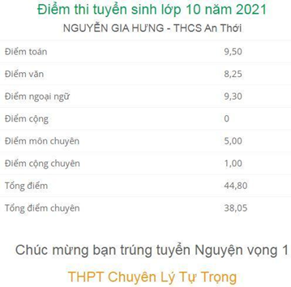
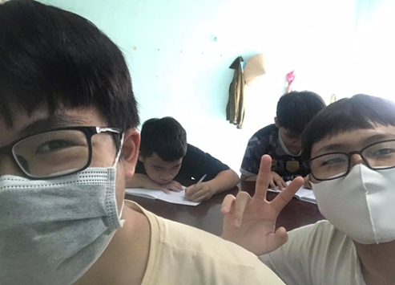

# 1. Chuyên Lý Tự Trọng

Vậy là những năm học cấp 2 đã khép lại với biết dao nhiêu kỉ niệm đẹp. Giờ đây, tôi đã chính thức trở thành một học sinh cấp 3 cực kì là ngầu. Bởi không phải là một học sinh cấp 3 bình thường, mà là học sinh của trường chuyên.

Tôi còn nhớ chiều tối ngày 15/6/2021, mặc dù tôi đã mệt mỏi rã rời vì cả ngày phải dọn dẹp, reset lại cái nhà, đến chiều tối vẫn còn một cái kệ sách đang dọn dẹp, sau khi nhận được tin tức rằng sở giáo dục sẽ công bố điểm thi vào 10 sớm hơn vào 7 giờ tối hôm đó, tôi luôn trong tâm trạng thấp thỏm, lo lắng và hi vọng, mở sẵn máy tính và liện tục nhấn F5.

Thật ra là buổi sáng hôm đó đã rất đặc biệt rồi. Sáng sớm tôi nổi hứng phải đi tập thể dục, nhưng lại không thích vào sân vận động, thế là tôi đạp xe đi dạo phố, đi ngắm cảnh trung tâm thành phố Cần Thơ lúc mặt trời chưa dậy. Hôm đó tôi đổi ý, khi đi đến đoạn đường Nguyễn Văn Cừ. Nếu như lúc trước thì sẽ rẽ trái ở ngã tư để vào trung tâm thì tôi lại có ý định thăm lại trường THCS Long Hoà – nơi tôi học HSG Hoá thực hành, có lẽ để ôn lại kỉ niệm thời còn đi học đôi chút.

Sau khi lượn quanh con đường quen thuộc mà ba thường chở tôi đi học đội tuyển thì tôi đi vào đường Bùi Hữu Nghĩa, định vào khu dân cư Ngân Thuận để chơi nhưng lại sợ không nhớ đường đi. Bỗng tôi thấy một chiếc xe cũng chạy theo đường đó nên tôi tti men theo rồi sau đó lại thấy đoàn xe tập thể dục buổi sáng. Tôi đi theo họ rồi lên cầu, nhớ lại rằng qua dốc cầu quẹo phải rồi sẽ tới (hoặc có lẽ vậy). Rồi qua cầu khung cảnh trở nên xa lạ, tôi thấy nên quay lại là an toàn nhất. Phải đi một quãng đường nữa mới cõ chỗ quay đầu. Tôi lại gồng mình để đạp xe lên dốc lần nữa. Rồi thả dốc xuống. Tôi đánh liều rẻ phải ở dốc cầu rồi bất ngờ nhận ra đây mới là khu Ngân Thuận.

Vừa đạp xe, tôi vừa nghĩ chuyện kì lạ gì đã xảy ra, đạp một hồi tôi thấy một công viên xinh đẹp hiện ra. Có lẽ đây là cái công viên mà Trúc nói trong lần đầu tôi chở Trúc về nhà và sẵn tiện ghé vào khu Ngân Thuận chơi. Nhưng lúc đó tôi chỉ thấy các công viên làm bùng binh thôi, nên hai đứa ở đó chơi. Ngay cả con Trúc cũng không nhớ đường đi nên chuyện đó đã gác lại. Nay cái công viên đó hiện ra, nên tôi đã đạp xe vào trong đó (nói đúng hơn là vòng quanh nó). Cảnh vật thật sự rất đẹp. Sau đó tôi đi trở ra đường chính để ra lộ lớn về nhà vì trời đã sáng lâu rồi và chân tôi đã mỏi nhừ. 

Bỗng nhiên tôi thấy nhớ cái kỉ niệm hồi lớp 7, cùng anh Quang Long, chị Thanh Ngọc, ... cả đội cùng đi thi Nét Đẹp Đội Viên ở trường Tiểu học Bình Thuỷ 2 cũng trong khu Ngân Thuận này. Rồi cũng tới cái công viên bùng binh mà tôi với Trúc đã ghé đó sau khi đi chơi, ăn trung thu ở nhà cô Phượng dạy hoá đội tuyển cho tôi.

Về đến nhà, tôi mệt rũ rượi, định đi tắm cho mát thì chú Tư gọi tới, hỏi tôi số báo danh để tra kết quả tuyển sinh. Tôi hú hồn hú vía, vì đãng lẽ ngày mai mới có kết quả mà hôm nay chú đã hỏi tôi rồi. Hỏi ra thì thím Tư chỉ nghe nói là mấy bạn trường khác coi được nên thím Tư mới hỏi vậy thôi, tôi không có niềm tin gì mấy.

Rồi sau đó tôi lên mạng search, không có. Tôi lại lên lướt Facebook, rồi quên đi tắm luôn. Đến 8 giờ, ba gửi tôi tin nhắn báo kết quả tuyển sinh của tôi. Hồn vía tôi lúc này ở trên mây. Mừng rỡ, tôi nói với mẹ. Mẹ nhờ tôi xem giúp Khang. Lúc lâu, ba mới gửi tin nhắn kết quả của Khang. Thấy điểm của nó thấp hơn điểm của mình nên không nói cho nó mà chỉ nói với mẹ. Lúc đó tôi chưa biết mình đã đầu trường chuyên hay chưa nữa. Bởi thật sự điểm của tôi chỉ mới trên điểm liệt một tí thôi, nên không nắm chắc cơ hội đậu và chuyên toán. Tôi vẫn mong chờ kết quả chính thức. Sau đó, tôi thấy trên group lớp nhắn tin 7 giờ tối nay sẽ có kết quả chính thức. Rồi cơn hồi hộp cũng tạm lắng để mẹ tôi gọi các chú sửa máy lạnh tới.

Sửa xong rồi, mẹ tôi lại dọn luôn phòng ốc, tôi cũng tân trang lại phòng của mình, làm rịu rã từ chiều tới tối. Lúc nghỉ tay, ăn mì, tôi nghe tiếng điện thoại của ba. Nghe máy giúp ba, thì đầu dây bên kia nói chuyện luôn với tôi rồi nói rằng tôi đậu rồi. Lúc đó tôi vẫn giữ bình tính để nói chuyện với chú, nhưng hồn tôi lúc này đã trồi về phương nào rồi kìa. Chú đó bảo mình vừa đủ điểm 4,5 để đậu chuyên. Tôi thấy kì kì. Rõ ràng ba nhắn mình là 5 điểm chuyên. Mà sao chú kia lại nói 4,5. Tôi nghĩ chắc người ta cộng 0,5 điểm luôn cho mình rồi mới được 5 ấy, vì tôi được giải nhì cấp thành phố môn toán tiếng anh mà. Sau đó tôi cảm ơn rồi cúp máy.

Tôi chạy lại báo với mẹ tin vui. Lúc đó tôi như muốn nhảy tưng tưng lên vì mừng quá. Mừng hơn nữa khi điểm chuyên của Khang cũng cao hơn điểm sàng mà tôi hỏi khi nãy. Báo tin với mẹ, rồi mẹ lại báo với Khang. Lúc đó, cả cuộc sống là một màu hồng. Rồi ba mề, mình nói với ba. Ba nói vậy là chắc đậu rồi. Tại vì tin nhắn đầu tiên ba gửi mình (kết quả của mình) là ba hỏi một người. Khi mình nhờ ba xem dùng Khang thì lại nhờ một người khác, là thầy Thuận của sở giáo dục, cũng chính là người vừa nãy gọi điện cho mình. Rõ rồi. Số 4,5 là điểm của Khang. Mà nếu Khang đậu thì mình sẽ đậu.

Dù đã biết trước kết quả nhưng gần đến 7 giờ, tôi lại hồi hộp như cũ. Một lần reload lại page, lần này page load chậm thật. Một lúc lâu sau, màn hình hiện lên kết quả tuyển sinh chính thức.

Tôi chính thức trở thành học sinh chuyên.

Mọi người trong lớp bắt đầu nhắn tin cho nhau. Có người vui. Có người lại buồn. Nhưng người vui nhất có lẽ là tôi với Khang. Rồi sau đó tôi cũng tìm ra cách để tra điểm của tất cả mọi người. Tôi tìm thấy điểm bạn học chuyên chung với húng tôi đa rớt. Nêu tôi với Khang báo tin riêng cho cô Thuỳ dạy chuyên cho chúng tôi.

Cô mừng lắm. Nhưng tiết là bạn Ngân không đậu. Phải nói là cả hai Ngân luôn chứ. Một bạn Ngân là người học chung chuyên toán với chúng tôi. Ngân kia là bạn cùng bàn với tôi nắm lớp 9. Ngân thi chuyên văn. Là em của chị Ngọc mà tôi nhắc đến trước đó cũng đậu chuyên văn. Nhưng em gái của chị lại không đậu.
Rồi tôi bắt đầu tra điểm bạn Đặng Quang Thành. Tôi thấy rất vui vì Thành đã đậu. Cảm giác lúc ấy thật khó tả, nó không phải niềm ui đơn thuần khi biết bản thân mình dậu vào chuyên, hay những người bạn thân với mình như Khang cùng đậu vào ngôi trường này. Cảm giác này đặc biệt hơn cả, cảm giác như một định mệnh mới sắp đến với tôi.

