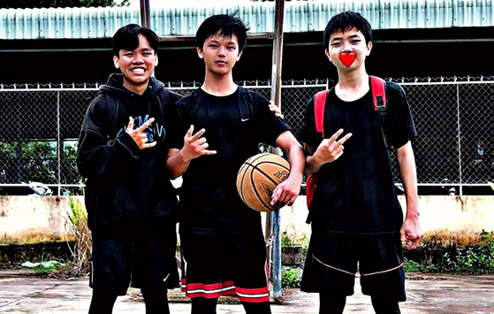

# 2. Thành
Thật ra ngày đó, rất lâu rồi, khi tôi còn học lớp 3, mẹ dẫn anh em tôi đi chùa, sinh hoạt ở đạo tràng Phật Thông. Tôi quen Thành ở đó, vì ở đó toàn người lớn, có tôi và Thành cùng lứa nên dẫn cũng quen nhau.

Hồi đó ở đạo tràng, ngoài Thành ra tôi còn quen anh Chương, Ti,... đêu là anh, bạn cùng lứa. Đến tuổi tham gia sinh hoạt hè trên chùa Phật Quang, chúng tôi cũng đi theo. Lúc này tôi chuẩn bị vào lớp 6. Trên chùa, tôi với Thành cũng thường chơi với nhau, bởi Thành nhỏ con nên dời qua chánh Định, kế bạn chánh Đạo của tôi nên cũng hay gặp nhau. Suốt từ năm lớp 3 đến lớp 6, tôi với Thành thường hay chơi chung, nói chuyện với nhau. Có một khoan thời gian Thành không tới đạo tràng, tôi cũng thấy bình thường. Lúc đó tôi chẳng biết tí gì cảm xúc cả.

Rồi đến hè lớp 6 lên 7, lại lên chùa sinh hoạt hè. Lần này trước khi lên chùa, mẹ đã tổ chức đi tắm biển cho tụi tôi, đi du lịch Vũng Tàu các kiểu, sau đó chúng tôi mới bắt đầu khoá hè. Tôi vẫn hay gặp Thành.

Rồi kết thúc khoá hè, mẹ lên đón tôi. Thái độ của mẹ kì lắm. Lên chùa mà nhìn ánh mắt mẹ buồn lắm. Lúc tôi ở lại dọn đồ, xếp đồ thất lạc mà không ai nhận, mẹ nhìn tôi phụ giúp các thầy. Ánh mắt mẹ vừa tự hào, vừa buồn rười rượi. Sau đó tôi thấy một cái khắn thêu tên Đặng Quang Thành. Tối thấy quen quen nên đưa lại cho Thành. Sau khi trở về Cần Thơ, chúng tôi tạm biệt nhau rồi trở về nhà.

Sau đó, tôi phát hiện lúc mình vắng nhà thì đã có chuyện gì đó xảy ra. Mẹ không đến chùa sinh hoạt đạo tràng nữa. Mình cảm thấy như bị hụt hẫn. Lần lần liên tiếp các sự kiện như dì Quy, dì Nhi, bác Thắng đến nhà nói chuyện, những lần đọc tin nhắn của mẹ với mọi người trong đạo tràng, mình thấy rằng mẹ đã cãi nhau, hay giận vì vấn đề gì đó mà bỏ đi khỏi đạo tràng.

Từ đó tới nay đã 4 năm rồi. Từ lần đầu lớp 7 đến đầu lớp 10, tôi chưa gặp lại Thành. Khoảng thời gian xa cách còn dài hơn quãng thời gian chúng tôi quen nhau. Tôi đã sớm không còn nhớ về người bạn này nữa.

Rồi hôm trường Lý Tự Trong công bố danh sách thì sinh đăng kí dự thi, tôi rảnh lắm, ngồi ntoe tên các đói thủ thi chuyên toán lại, những người có điểm cao trong các kì thi học sinh giỏi thành phố môn toán. Kết quả là tôi tính được: nếu trừ những nười có giải ra thì còn lại 10 slot cho lớp 35 người.

Trong lúc đang dò tên các đối thủ, tôi lướt qua một cái tên. Vừa là mà vừa quen. Hình như đã gặp người ngày rồi. “Đặng Quang Thành”. Trong kí ức tôi dường như mang máng nhớ ra điều gì đó. Rồi nhìn tên trường Huỳnh Thúc Kháng, tôi như chắc chắn đấy là người bạn ngày xưa. Để chắc hơn nữa, tôi lấy danh sách những người trong đạo tràng của mẹ ra để đối chiếu. Họ và tên, ngày sinh, tất cả đều trùng khớp.

Tối đó tôi lên Facebook tìm tên Đặng Quang Thành, rồi Quang Thành, rồi tới Đặng Thành. Tôi thấy một tài khoản ghi trường học Huỳnh Thúc kHáng. Ở trang cá nhân, nhấp vào ảnh bìa chụp ba người chơi bóng rổ. Người ở giữa cầm bóng, gương mặt cực kì đẹp trai, và cũng cực kì quen thuộc. Cảm tường hình như đúng là Thành rồi.

Để chắc hơn nữa, tôi lên Youtube kiếm lại vài khoảng khắc nhỏ nhoi có mặt Thành tại khoá hè năm lớp 6 lên 7. Rõ rành chính là đôi mắt quen thuộc của người bạn ngày xưa. Mừng quá, tôi gửi lời mời kết bạn.

Chẳng hiểu tôi nghĩ sau chứ tối hôm đó tôi tập thể dục. Sáng chủ nhật hôm sau tôi lại siêng ra sân vận động chạy bộ, trong đầu chỉ có ý nghĩ là phải giảm cân sao cho thật đẹp để xuất hiện trước mặt Thành. Có Thành chọn thi chuyên đúng là động lực để tôi cố gắng đậu nguyện vọng 1. Tối tối tôi ngồi thiền, niệm Phật, cầu Phật cho các bạn đều đạu vào trường mong muốn, tôi cấu cho tôi và Thành có thể gặp lại nhau. Tôi nghĩ nếu chúng tôi học cùng một lớp khả năng coá là tôi sẽ lại được trở về đạo tràng, trở về tu tập.

Mấy ngày rồi vẫn không thấy Thành accept, tôi gửi lại lời mời, cũng rất lâu luôn. Tôi để ý Thành không đăng gì trên trang cá nhân đó từ lâu rồi nên tôi nghĩ nick đó đã bị hack. Tôi search lại tên Đặng Thành, rồi thấy một tài khoản avatar bóng rổ nên tôi vào, gửi lời mời. Vài giờ sau lên mạng, tôi đã thấy Thành accept rồi. Sau đó vào trang cá nhân, tôi thấy có clip kỉ yếu của lớp 9A2 trường Huỳnh Thúc Kháng. Khả năng cao đây là nick của Thành. Rồi hôm nào đó Thành đổi avatar thành logo của Lý Tự Trọng, tôi đã chắc chắn rằng đây đích thị là nick của Thành.
Dù đã kết bạn được rồi nhưng tôi vẫn chưa dám nhắn tin với Thành. Cứ lặng lẽ, âm thầm biết là được, kể cả mẹ tôi cũng không dám nói.

Đến hôm thấy Thành đã đậu rồi. Tôi vui lắm. Vì sắp được gặp lại bạn cũ sau một khoảng thời gian dài. Thật ra mấy hôm còn ở trường thi, tôi cũng đã đi ngang Thành. Tôi thấy Thành, biết Thành, nhưng không biết Thành có thấy tôi không, có nhớ đến tôi không. Lúc ở nhà, tôi đã định sẵn luôn kế hoặc gặp lại bạn cũ ra sao, nói những gì. Nhưng khi đi ngang qua Thành, tôi lại ấp a ấp úng, không dám nhùng thẳng mặt chứ đừng nói là bắt chuyện.

Ba ngày thi cứ thế trôi qua, tôi để mặc cho duyên phận. Nếu hữu duyên, Thành và tôi thi đậu thì tốt rồi. Còn nếu không có duyên, nếu tôi hoặc Thành rớt thì tôi ân hận suốt đời. Thế nên, suốt thời gian sau thi, tôi vẫn luôn chờ đợi, mong ngóng kết quả là do vậy.

Bấy giờ, kết quả đã có, tôi đã nói với mẹ. Mẹ bảo tôi với Thành có duyên với nhau. Thì ra đúng là vậy.

Giờ đây, tôi đã là học sinh cấp 3, một LTT-er, cần phải rất nhiều cố gắng, nỗ lực, nhưng vẫn sẽ có những kỉ niệm đẹp sau này, những điều mà có lẽ tôi sẽ không bao giờ quên...
